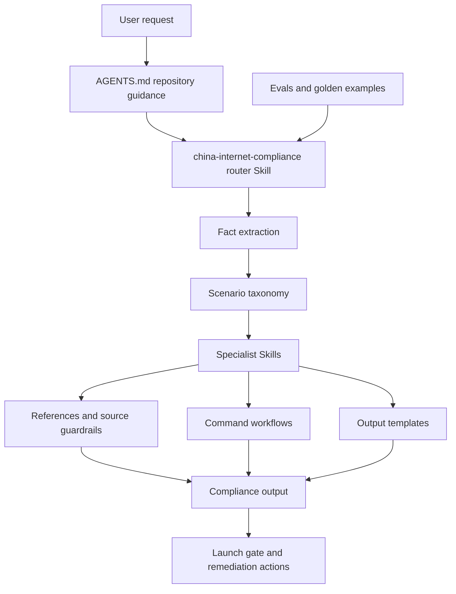

# Architecture

本项目是一个 Codex repo-scoped Skill 套件，核心目标是把中国互联网合规审查拆成可路由、可复核、可测试、可维护的工作流。

## High-Level Flow

## Main Components

| Component | Path | Purpose |
|---|---|---|
| Repository guidance | `AGENTS.md` | Tells Codex how to treat the repo and route compliance tasks |
| Router Skill | `.agents/skills/china-internet-compliance/SKILL.md` | Main entrypoint for cross-domain compliance review |
| Specialist Skills | `.agents/skills/china-*/SKILL.md` | Domain-specific review logic and quality gates |
| Commands | `.agents/skills/china-internet-compliance/commands/` | Stable command contracts for recurring workflows |
| References | `.agents/skills/china-internet-compliance/references/` | Scenario taxonomy, rules, citation guardrails, source verification and risk matrix |
| Templates | `.agents/skills/china-internet-compliance/templates/` | Structured output formats for common review types |
| Profiles | `.agents/skills/china-internet-compliance/profiles/` | Company-specific risk appetite and approval templates |
| Connectors | `.agents/skills/china-internet-compliance/connectors/` | Specs for integrating PRDs, policies, data maps, contracts, SDK lists and source repositories |
| Agents | `.agents/skills/china-internet-compliance/agents/` | Watcher/reviewer designs for future automation |
| Evals | `.agents/skills/china-internet-compliance/evals/` | Rubrics, expected issues and test suite metadata |
| Golden examples | `.agents/skills/china-internet-compliance/golden_examples/` | Reference-quality outputs for evaluation and tuning |

## Routing Model

The router Skill should:

1. Extract facts using `INPUT_FACT_SCHEMA.md`.
2. Classify the scenario using `INDUSTRY_SCENARIO_TAXONOMY.md`.
3. Route to one or more specialist Skills.
4. Apply company profiles when present.
5. Use source verification and citation guardrails for legal/regulatory conclusions.
6. Produce a gate decision with risk level, basis, evidence gaps, remediation owners and next steps.

## Specialist Model

Each specialist Skill should contain:

- Required input fields
- Decision tree
- P0/P1 triggers
- Evidence requirements
- Cross-skill routing rules
- Quality threshold

Specialists should not assume a company, product line or industry unless the user provides facts.

## Command Model

Command files in `commands/` define stable workflows such as:

- quick triage
- launch review
- data PIA
- AI algorithm review
- OSS review
- vendor review
- regulatory response
- cold-start interview

Each command should specify required inputs, execution steps, missing-material handling, output schema and quality threshold.

## Evaluation Model

The eval pack is designed to make the Skill suite maintainable:

- `prompts/test_cases.md` contains full-scenario test cases.
- `evals/expected_issues.json` maps cases to expected risk coverage.
- `evals/rubric.md` and specialist rubrics define scoring dimensions.
- `golden_examples/` provides reference-quality outputs.
- `scripts/validate_skill.py` checks package structure.
- `scripts/evaluate_outputs.py` can score generated outputs against expected coverage.

## Versioning

The public version is `V1.0.0`. Future changes should distinguish:

- Rule/source updates
- Skill behavior changes
- Template changes
- Evaluation changes
- Documentation-only changes
- Breaking changes
